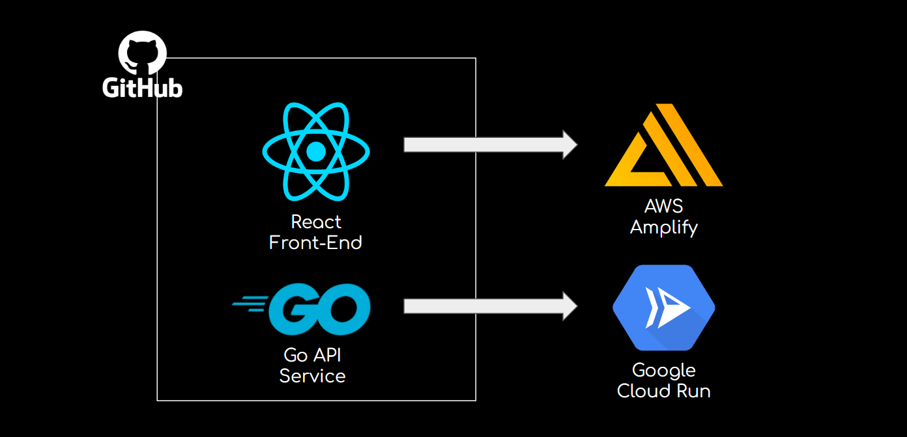

# AI-Powered System Design Copilot

**Demo**: https://youtu.be/s2vfirCqVfo?si=p6f9v8qMeqfUEhWD

## Description

This project is an AI-powered system design copilot, built to help users learn and create software architectures by offering real-time feedback on design decisions and tradeoffs. It features an interactive web app developed with React, including a chat interface that guides users step-by-step through design choices. Users can construct, visualize, and receive feedback on system design diagrams.

The backend, developed with Go and the Azure OpenAI SDK, uses a chat-stream API to process user queries and stream insightful responses directly to the client, enriching both the learning and design experience.

## Technologies Used

- **Microsoft Azure OpenAI**
- **Go**
- **React**
- **TypeScript**
- **Docker**

## Deployment

The Go API service and React frontend app are stored together in a monorepo on GitHub. The deployment process includes:

- **React Frontend**: Deployed via AWS Amplify.
- **Backend Service**: Deployed as a Docker image using Google Cloud Run.

Both frontend and backend support continuous deployment for streamlined updates.

---

Feel free to contribute or reach out with any feedback or questions!
